# Diagrama de Fluxo de Dados (DFD) - Black Belt Platform

## 1. DFD Nível 0 - Visão Geral do Sistema

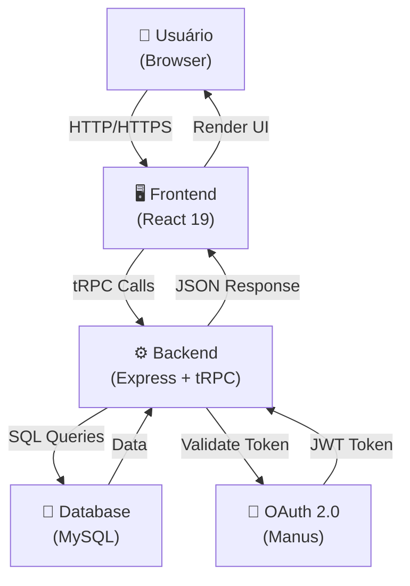

---

## 2. DFD Nível 1 - Fluxo de Autenticação

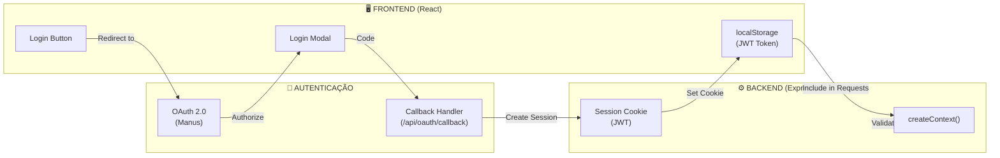

---

## 3. DFD Nível 1 - Fluxo de Requisição tRPC

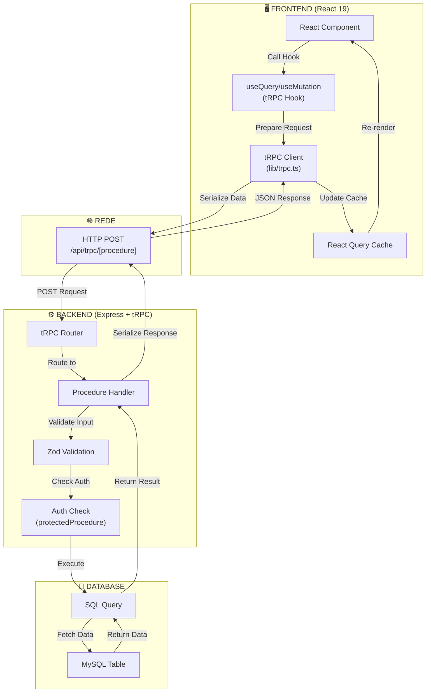

---

## 4. DFD Nível 2 - Fluxo de Dados Multi-Tenant

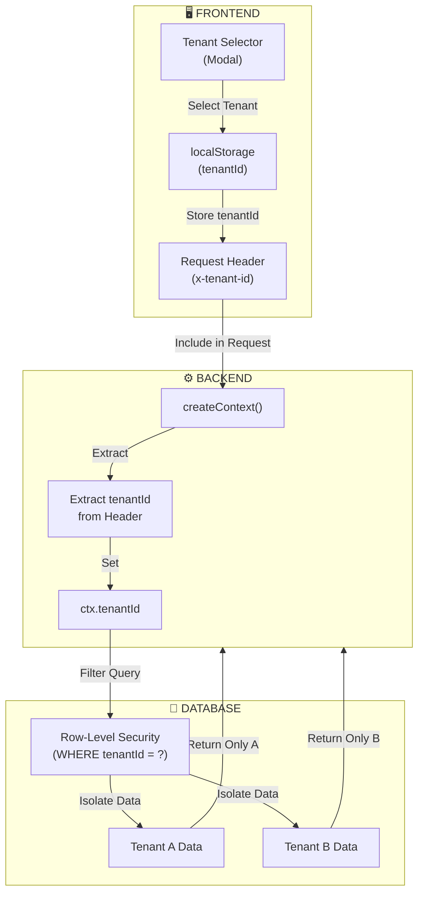

---

## 5. DFD Nível 2 - Fluxo de CRUD (Create, Read, Update, Delete)

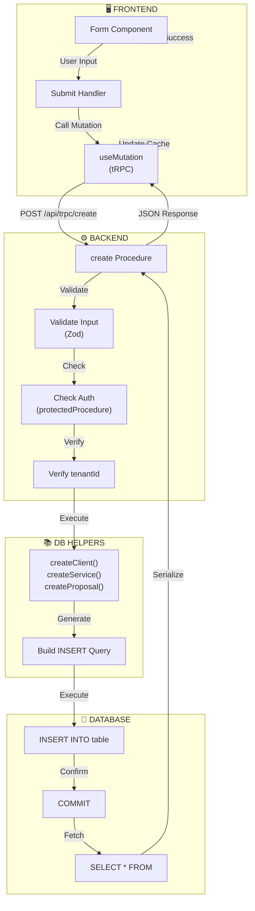

---

## 6. DFD Nível 2 - Fluxo de Precificação

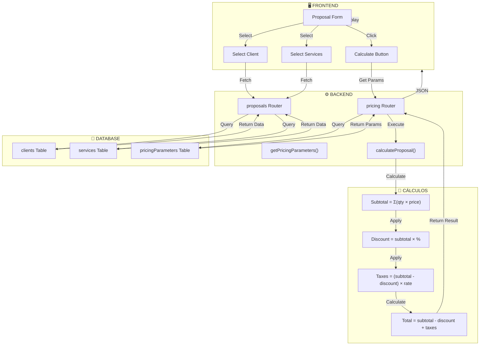

---

## 7. DFD Nível 2 - Fluxo de Auditoria

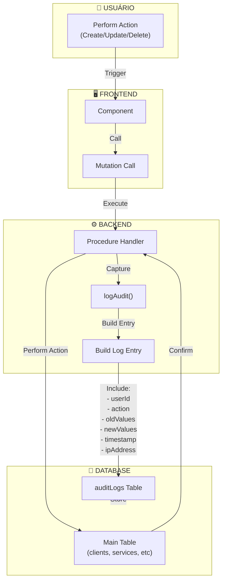

---

## 8. DFD Nível 3 - Fluxo Completo de Avaliação NR-01

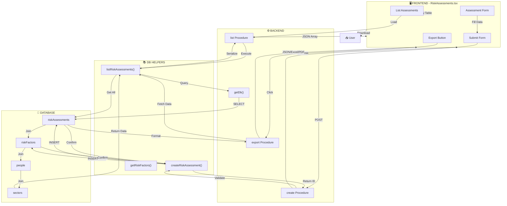

---

## 9. DFD Nível 3 - Fluxo de Validação e Segurança

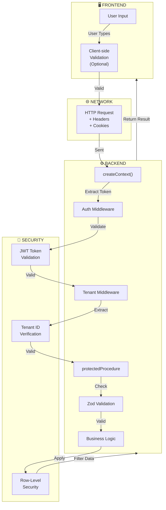

---

## 10. DFD Nível 3 - Fluxo de Cache e Revalidação

```mermaid
graph TB
    subgraph Frontend["🖥️ FRONTEND"]
        Component["Component"]
        Query["useQuery()"]
        Cache["React Query<br/>Cache"]
        Stale["Stale Data"]
    end
    
    subgraph Backend["⚙️ BACKEND"]
        Procedure["Procedure"]
        DB["Database"]
    end
    
    Component -->|First Load| Query
    Query -->|Check Cache| Cache
    Cache -->|Miss| Procedure
    Procedure -->|Fetch| DB
    DB -->|Return| Procedure
    Procedure -->|Return Data| Query
    Query -->|Store| Cache
    Query -->|Render| Component
    
    Component -->|Second Load<br/>(within TTL)| Query
    Query -->|Check Cache| Cache
    Cache -->|Hit| Query
    Query -->|Return Cached| Component
    
    Component -->|Mutation| Procedure
    Procedure -->|Execute| DB
    DB -->|Confirm| Procedure
    Procedure -->|Success| Component
    Component -->|Invalidate| Cache
    Cache -->|Clear| Stale
    Stale -->|Refetch| Query
    Query -->|Fresh Data| Procedure
    Procedure -->|Return| Query
    Query -->|Update Cache| Cache
    Cache -->|Render| Component
```

---

## 11. Fluxo de Dados - Exemplo Prático: Criar Proposta

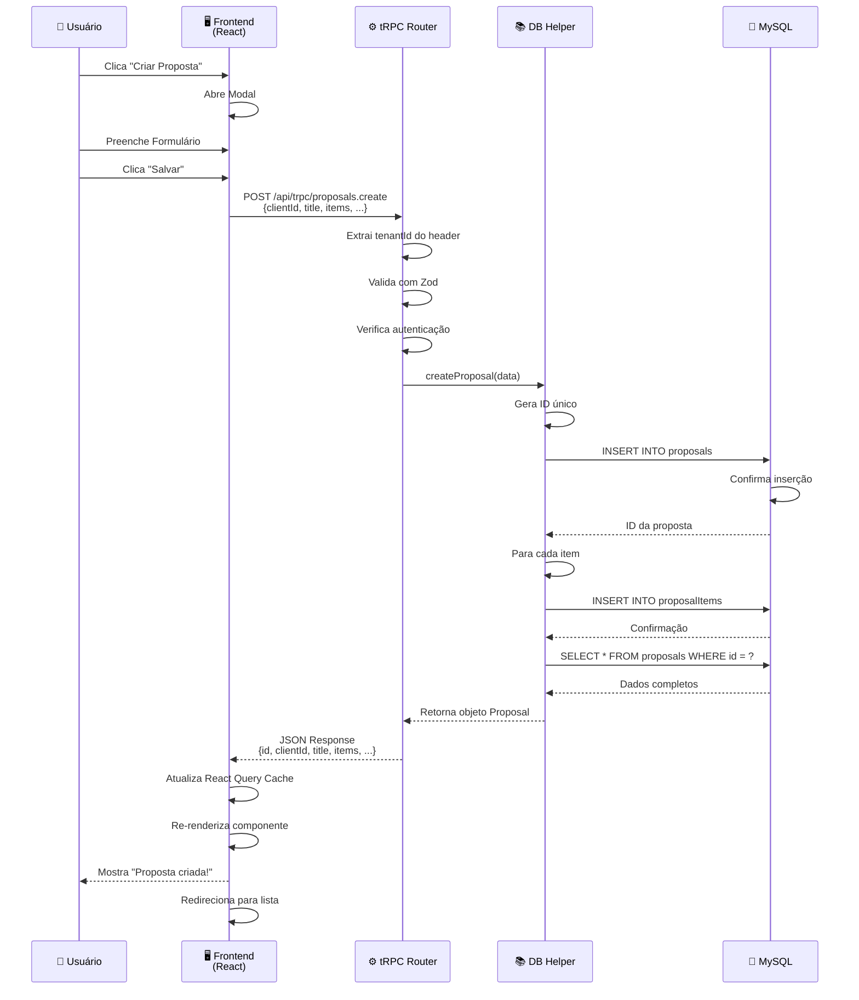

---

## 12. Arquitetura em Camadas - Fluxo Vertical

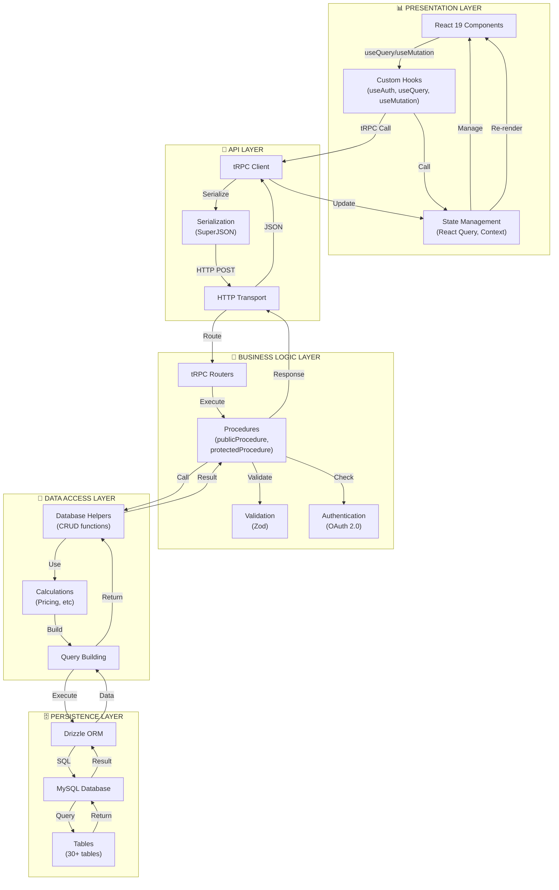

---

## 13. Fluxo de Dados - Isolamento Multi-Tenant

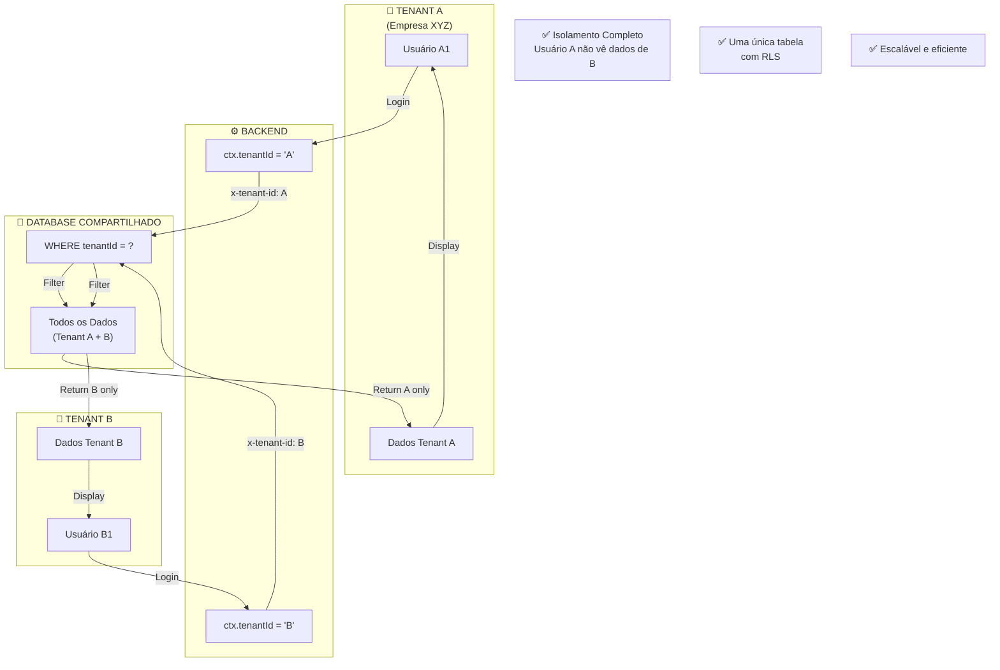

---

## 14. Fluxo de Integração: Avaliação → Proposta

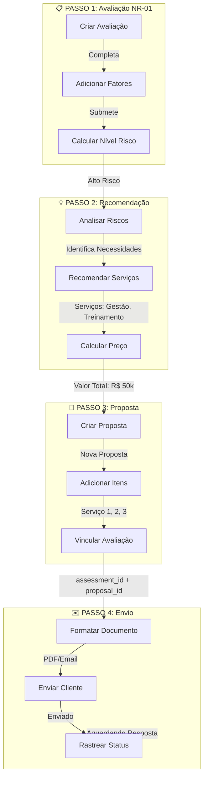

---

## 15. Resumo de Componentes e Fluxos

| Componente | Função | Entrada | Saída |
|-----------|--------|---------|-------|
| **Frontend** | Interface de usuário | Ações do usuário | Requisições tRPC |
| **tRPC Router** | Roteamento de procedures | Requisição HTTP | Resposta JSON |
| **Procedure** | Lógica de negócio | Dados validados | Resultado processado |
| **DB Helper** | Acesso a dados | Parâmetros de query | Dados do banco |
| **Drizzle ORM** | Mapeamento objeto-relacional | Queries tipadas | Resultados SQL |
| **MySQL** | Persistência de dados | SQL queries | Dados brutos |

---

## 16. Fluxo de Segurança - Camadas de Proteção

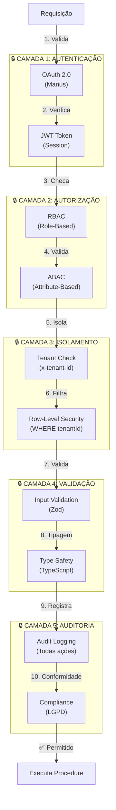

---

## Notas Importantes

1. **tRPC**: Comunica via HTTP POST para `/api/trpc/[procedure]`
2. **Serialização**: SuperJSON permite enviar Dates, Maps, Sets, etc.
3. **Cache**: React Query gerencia cache automaticamente
4. **Validação**: Zod valida entrada em tempo de execução
5. **Multi-Tenant**: Isolamento via `tenantId` em todas as queries
6. **Segurança**: 5 camadas de proteção (OAuth, RBAC, RLS, Validação, Auditoria)
7. **Performance**: Índices em colunas críticas (tenantId, userId, timestamps)
8. **Escalabilidade**: Arquitetura preparada para múltiplos tenants e alta concorrência

---

**Fim do Diagrama de Fluxo de Dados**

