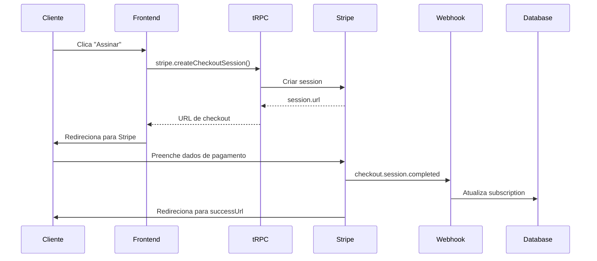
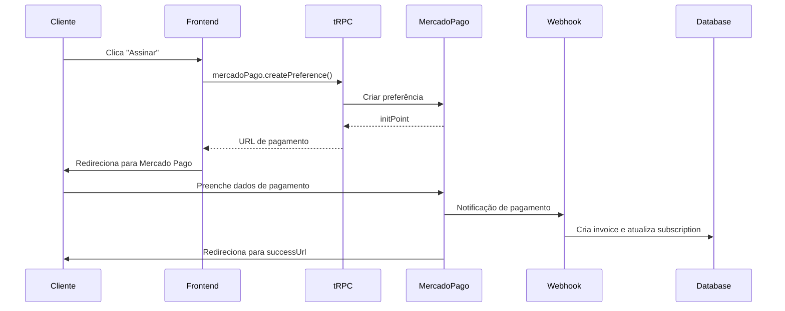

# Fase 2 - Integração Stripe/Mercado Pago - Guia de Implementação

## ✅ Implementação Completa

A integração com Stripe e Mercado Pago foi implementada com sucesso!

## 📦 Pacotes Instalados

```json
{
  "stripe": "^20.0.0",
  "mercadopago": "^2.11.0"
}
```

## 🏗️ Arquitetura Implementada

### Routers tRPC Criados

#### 1. **Stripe Router** (`server/routers/stripe.ts`)

Endpoints disponíveis:
- `stripe.isEnabled` - Verificar se Stripe está configurado
- `stripe.createCheckoutSession` - Criar sessão de checkout para nova assinatura
- `stripe.createCustomerPortal` - Abrir portal do cliente para gerenciar assinatura
- `stripe.getSubscriptionDetails` - Obter detalhes da assinatura no Stripe
- `stripe.cancelSubscription` - Cancelar assinatura (imediato ou no final do período)
- `stripe.reactivateSubscription` - Reativar assinatura cancelada
- `stripe.listPaymentMethods` - Listar métodos de pagamento do cliente

**Webhook Handler:** `handleStripeWebhook()` - Processa eventos do Stripe

#### 2. **Mercado Pago Router** (`server/routers/mercadopago.ts`)

Endpoints disponíveis:
- `mercadoPago.isEnabled` - Verificar se Mercado Pago está configurado
- `mercadoPago.createPreference` - Criar preferência de pagamento
- `mercadoPago.createSubscriptionPlan` - Criar plano de assinatura recorrente
- `mercadoPago.getPaymentDetails` - Obter detalhes de um pagamento
- `mercadoPago.cancelSubscription` - Cancelar assinatura

**Webhook Handler:** `handleMercadoPagoWebhook()` - Processa notificações do Mercado Pago

### Webhooks Registrados

Os webhooks foram configurados no servidor Express (`server/_core/index.ts`):

```typescript
// Stripe - antes do body parsing (precisa raw body)
POST /api/webhooks/stripe

// Mercado Pago - depois do body parsing (usa JSON)
POST /api/webhooks/mercadopago
```

## 🔧 Configuração

### 1. Variáveis de Ambiente

Adicione ao seu `.env`:

```env
# Stripe
STRIPE_ENABLED=true
STRIPE_PUBLIC_KEY=pk_test_...
STRIPE_SECRET_KEY=sk_test_...
STRIPE_WEBHOOK_SECRET=whsec_...

# Mercado Pago
MERCADO_PAGO_ENABLED=true
MERCADO_PAGO_PUBLIC_KEY=TEST-...
MERCADO_PAGO_ACCESS_TOKEN=TEST-...
MERCADO_PAGO_WEBHOOK_SECRET=...

# Webhook URLs
MERCADO_PAGO_WEBHOOK_URL=https://your-domain.com/api/webhooks/mercadopago
```

### 2. Configurar Webhooks nos Provedores

#### Stripe

1. Acesse: https://dashboard.stripe.com/webhooks
2. Clique em "Add endpoint"
3. URL: `https://your-domain.com/api/webhooks/stripe`
4. Eventos a ouvir:
   - `checkout.session.completed`
   - `customer.subscription.updated`
   - `customer.subscription.deleted`
   - `invoice.paid`
   - `invoice.payment_failed`
5. Copie o "Signing secret" para `STRIPE_WEBHOOK_SECRET`

#### Mercado Pago

1. Acesse: https://www.mercadopago.com.br/developers/panel/app
2. Selecione sua aplicação
3. Vá para "Webhooks"
4. Adicione URL: `https://your-domain.com/api/webhooks/mercadopago`
5. Eventos:
   - `payment`
   - `subscription`

### 3. Testar em Desenvolvimento

Para testar webhooks localmente, use **ngrok** ou **localtunnel**:

```bash
# Instalar ngrok
npm install -g ngrok

# Expor porta 3000
ngrok http 3000

# Use a URL fornecida (ex: https://abc123.ngrok.io)
# Configure nos dashboards dos provedores
```

## 💳 Fluxo de Pagamento

### Fluxo Stripe



### Fluxo Mercado Pago



## 🎯 Exemplo de Uso (Frontend)

### Iniciar Checkout - Stripe

```typescript
import { trpc } from '@/lib/trpc';

function SubscribePlan() {
  const createCheckout = trpc.stripe.createCheckoutSession.useMutation();
  
  const handleSubscribe = async (planId: string) => {
    const result = await createCheckout.mutateAsync({
      planId,
      billingCycle: 'monthly',
      successUrl: `${window.location.origin}/subscription/success`,
      cancelUrl: `${window.location.origin}/pricing`,
    });
    
    // Redirecionar para Stripe Checkout
    window.location.href = result.url!;
  };
  
  return (
    <button onClick={() => handleSubscribe('plan_starter')}>
      Assinar Plano Starter
    </button>
  );
}
```

### Iniciar Checkout - Mercado Pago

```typescript
import { trpc } from '@/lib/trpc';

function SubscribePlan() {
  const createPreference = trpc.mercadoPago.createPreference.useMutation();
  
  const handleSubscribe = async (planId: string) => {
    const result = await createPreference.mutateAsync({
      planId,
      billingCycle: 'monthly',
      successUrl: `${window.location.origin}/subscription/success`,
      failureUrl: `${window.location.origin}/subscription/failure`,
      pendingUrl: `${window.location.origin}/subscription/pending`,
    });
    
    // Redirecionar para Mercado Pago
    window.location.href = result.initPoint;
  };
  
  return (
    <button onClick={() => handleSubscribe('plan_starter')}>
      Assinar Plano Starter
    </button>
  );
}
```

### Portal do Cliente - Stripe

```typescript
function ManageSubscription() {
  const createPortal = trpc.stripe.createCustomerPortal.useMutation();
  
  const handleManage = async () => {
    const result = await createPortal.mutateAsync({
      returnUrl: window.location.href,
    });
    
    window.location.href = result.url;
  };
  
  return (
    <button onClick={handleManage}>
      Gerenciar Assinatura
    </button>
  );
}
```

## 🔍 Eventos de Webhook Processados

### Stripe

| Evento | Ação |
|--------|------|
| `checkout.session.completed` | Atualiza subscription com IDs do Stripe, ativa trial |
| `customer.subscription.updated` | Sincroniza status, datas de período, cancelamento |
| `customer.subscription.deleted` | Marca subscription como cancelada |
| `invoice.paid` | Cria registro de invoice, marca subscription como active |
| `invoice.payment_failed` | Marca subscription como past_due |

### Mercado Pago

| Tipo | Status | Ação |
|------|--------|------|
| `payment` | `approved` | Cria invoice, ativa subscription |
| `payment` | `rejected`/`cancelled` | Marca subscription como unpaid |
| `subscription` | `cancelled` | Marca subscription como canceled |
| `subscription` | `paused` | Marca subscription como past_due |

## 🧪 Testes

36 novos testes foram adicionados em `server/__tests__/payment-gateway.test.ts`:

```bash
# Rodar todos os testes
pnpm test

# Rodar apenas testes de pagamento
pnpm test payment-gateway
```

**Total de testes:** 209 (149 originais + 24 subscription + 36 payment)

## 🔒 Segurança

### Validação de Webhooks

**Stripe:**
- Valida assinatura usando `stripe.webhooks.constructEvent()`
- Requer `STRIPE_WEBHOOK_SECRET`
- Body deve ser raw (não parsed)

**Mercado Pago:**
- Processa eventos autenticados via token de acesso
- Valida origem das notificações

### Rate Limiting

Os webhooks não têm rate limiting para não bloquear notificações dos provedores. Isso é seguro porque:
1. Stripe valida assinatura criptográfica
2. Mercado Pago requer token de acesso
3. Processamento é idempotente (mesmos eventos podem ser reprocessados)

## 📊 Próximos Passos (Fase 3)

Com a integração completa, podemos agora:

1. **Criar UI de Checkout** - Páginas React para seleção de plano e checkout
2. **Dashboard de Assinatura** - Mostrar status, uso, e histórico de faturas
3. **Gerenciamento de Pagamento** - Atualizar método de pagamento
4. **Notificações** - Alertar sobre trial expirando, falhas de pagamento, etc.

Veja `ROADMAP_COMERCIALIZACAO.md` para detalhes completos.

## 🆘 Troubleshooting

### Erro: "Stripe not configured"

**Solução:** Verifique se `STRIPE_ENABLED=true` e todas as chaves estão configuradas.

### Erro: "Webhook signature verification failed"

**Solução:** Verifique se o `STRIPE_WEBHOOK_SECRET` está correto. Deve começar com `whsec_`.

### Webhooks não recebem eventos

**Solução:** 
1. Verifique se a URL pública está acessível
2. Teste com ngrok em desenvolvimento
3. Verifique logs do dashboard do provedor

### Pagamento aprovado mas subscription não ativa

**Solução:**
1. Verifique logs do webhook
2. Confirme que o `tenantId` está sendo passado nos metadados
3. Verifique se o banco de dados está acessível

## 📚 Recursos

- [Stripe Subscriptions Docs](https://stripe.com/docs/billing/subscriptions)
- [Stripe Webhooks Guide](https://stripe.com/docs/webhooks)
- [Mercado Pago Docs](https://www.mercadopago.com.br/developers)
- [Mercado Pago Webhooks](https://www.mercadopago.com.br/developers/pt/docs/your-integrations/notifications/webhooks)

## ✅ Checklist de Implementação

- [x] Instalar SDKs (Stripe, Mercado Pago)
- [x] Criar router Stripe com 7 endpoints
- [x] Criar router Mercado Pago com 4 endpoints
- [x] Implementar handlers de webhook
- [x] Registrar endpoints no Express
- [x] Adicionar variáveis de ambiente
- [x] Criar testes (36 testes)
- [x] Documentar integração
- [ ] Configurar webhooks em produção (requer deploy)
- [ ] Criar UI de checkout (Fase 3)
- [ ] Testar fluxo completo em produção

---

**Status:** ✅ Fase 2 Completa - Pronto para Fase 3 (UI)
